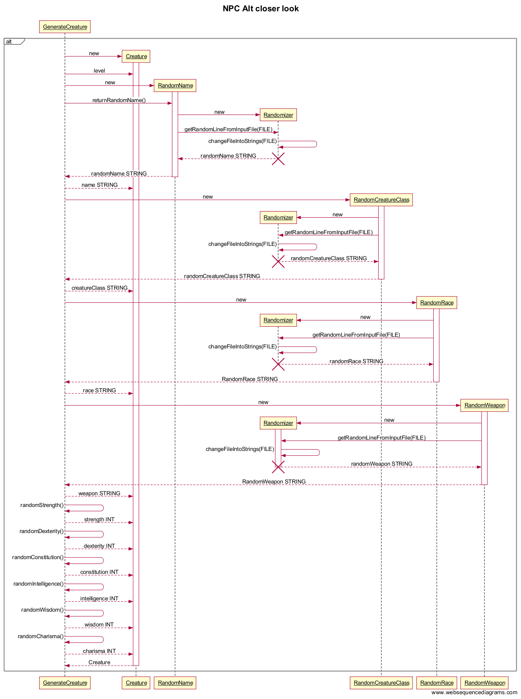

## **Aihe:** Monster generator

**Aihekuvaus:**    
Toteutetaan ohjelma, joka satunnaisgeneroi hirviöitä ja NPC-hahmoja roolipeliä varten.   
Tarkoituksena on kehittää järjestelmä, jolla pystytään luomaan satunnainen hahmo Dungeons and Dragons 5 edition mukaisesti, toki hieman soveltaen.

Hahmoille generoidaan erilaisia ominaisuuksia, kuten hahmoluokka, nimi, statistiikka (voima, nopeus, jne) sekä ase.

[Rakennekuvaus](rakennekuvaus.md)     
   
**Käyttäjät:**    
Ohjelma ei vaadi kirjautumista, joten käyttäjä on käyttäjä.
   
**Toiminnot:**   
- päätä tehdäänkö hirviö vai npc
- päätä luodun hahmon taso
- luo hahmo
   
**Luokkakaavio:**   
   
 

**Sekvenssikaavio:**   
   
![Kaavion paikka](Monster_sekvenssikaavio.png "https://www.websequencediagrams.com/?lz=dGl0bGUgTW9uc3RlciBHZW5lcmF0b3IKCk1haW4tPiorR3JhcGhpY1VzZXJJbnRlcmZhY2U6IG5ldwoABhQtPgAaFnJ1bigpABsXKitBY3Rpb25MaXN0ZW5lckZvckdVSQBeBgAGFABMGAA6BgoAgQIWLT4ATxZsZXZlbAAFLmFsdCBidXR0b24AgQgXKisAgkEHZUNyZWF0dXIAgisGKABnBSBJTlQAgXMXAIEMGGcARwcKYWx0IE5QQwCBfhgAZBFjcmVhdGUoKQoKAIEBEC0-KisAgRQJAINIBQAQEQCBMwkAghwHAC8TUmFuZG9tTmFtACwYABYLcmV0dXJuACgKKCkKADUKLT4qAEYGaXplcgCBCwUAEAwAEAtnZXQAbwZMaW5lRnJvbUlucHV0RmlsZShGSUxFAEwIaXplcgArDWNoYW5nZUZpbGVJbnRvU3RyaW5ncwAhEgCBJA4AgVUJIFNUUklORwpkZXN0cm95IACBIgoAgTgMLT4tAINnEQAyEgCCeREAgl8LbgBhCwCCVhsAhE4IQ2xhc3MAgiMLAAsNAII7GAAWDwCBanIAgTAOAIJfBgCBRQ0Agk0hAIFaDgCCXRoAQRUAgmQcAIYrBQB3EACFXxtSYWMAhjgGAAUKAIUyGAAWBgCEWHIAgR4FAIVEBlJhYwCFKCIAgT8FAIU2FACBaAoAhSYkcgBhCwCIIBtXZWFwb24Ah2YLAAsGAIhSCgCIAQ8AFwgAhyByAIEjBwCIDgYAgTEGAId1IQCBRgcAgjQaADoOAId-HHcAZQ0AizwTAIhjF1N0cmVuZ3RoKCkAiFwdcwAgByBJTlQAMypEZXh0ZXJpdHkAPx9kACAIADEuQ29uc3RpdHV0aW8AkDgFAIcdHAAgCwCBFi5JbnRlbGxpZ2VuY2UAggYfaQAgCwCBey5XaXNkb20AgmUfdwAgBQCBdC9oYXJpc21hAIF_IAAgBwCDWgUKAIxvCwCNHxIAkSoIAI0UFACTERYAKQkKZWxzAJRCCQCQcjIAjgYTLQBTHwCSZxhQcmludACUQAluZXcoAJMBCCkAlDsXACQOcHJpbnQAkzQIKCkKAEMNAIB_GQAxBQCQIwhlbmQKbm90ZSBvdgCWTgoAlAcJCiAgIACUQwV0b2ltaW50YQAMBXZpZWzDpCBrZXNrZW4AHgV0w6RsbMOkIGhldGtlbGzDpAA0BW1vbGVtbWlzc2Egc2FtYSAAJQYARAZvCmVuZCBub3QAggYYLQCXOxYAgTANAJcvLACCJwVPdXQAMxAAlm8YLU1haW46IEVYSVQAkkcJTWFpbgo&s=rose")    
HUOM: Sekvenssikaaviossa luokka Randomizer lopetetaan monesti, vaikka todellisuudessa luokkaa ei suljeta. Tämä johtuu kuvantekotyökalun rajoitteesta, ilman tätä kuva sekoaa.   

**Tarkempi sekvenssikaavio hahmon luonnista:**
      
