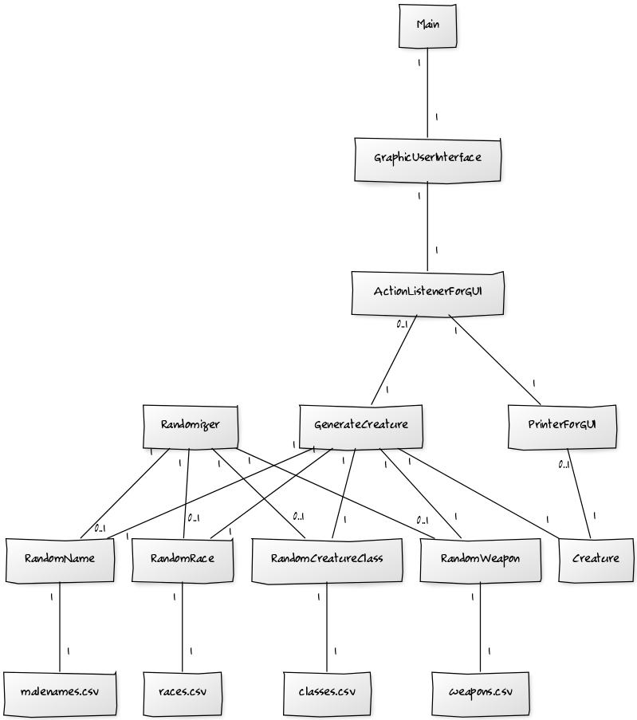
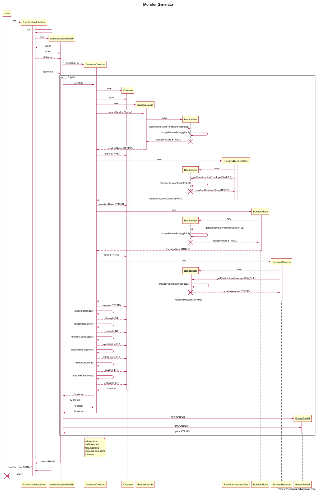

## **Aihe:** Monster generator

**Aihekuvaus:**    
Toteutetaan ohjelma, joka satunnaisgeneroi hirviöitä ja NPC-hahmoja roolipeliä varten.   
Tarkoituksena on kehittää järjestelmä, jolla pystytään luomaan satunnainen hahmo Dungeons and Dragons 5 edition mukaisesti, toki hieman soveltaen.

Hahmoille generoidaan erilaisia ominaisuuksia, kuten hahmoluokka, nimi, statistiikka (voima, nopeus, jne) sekä ase.

[Rakennekuvaus](rakennekuvaus.md)     
   
**Käyttäjät:**    
Ohjelma ei vaadi kirjautumista, joten käyttäjä on käyttäjä.
   
**Toiminnot:**   
- päätä tehdäänkö hirviö vai npc
- päätä luodun hahmon taso
- luo hahmo
   
**Luokkakaavio:**   
   
 

**Sekvenssikaavio:**   
   
 